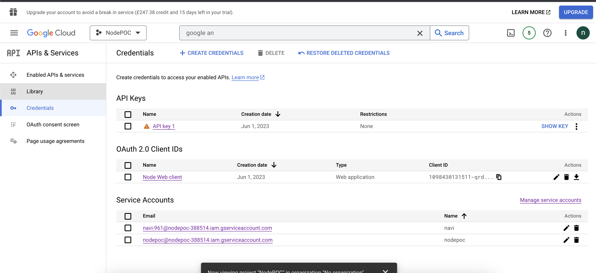
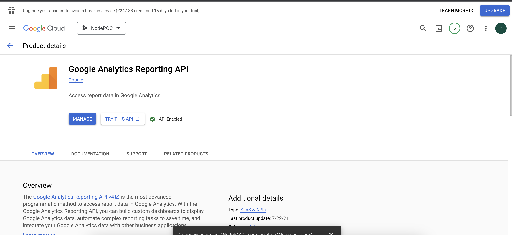
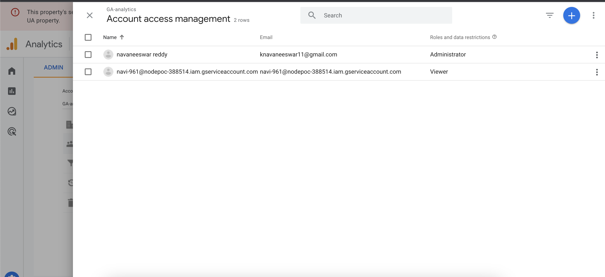
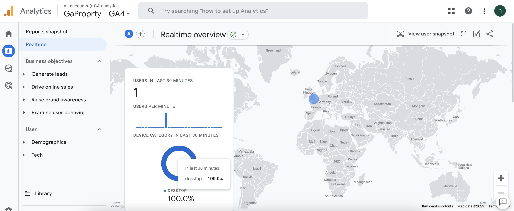
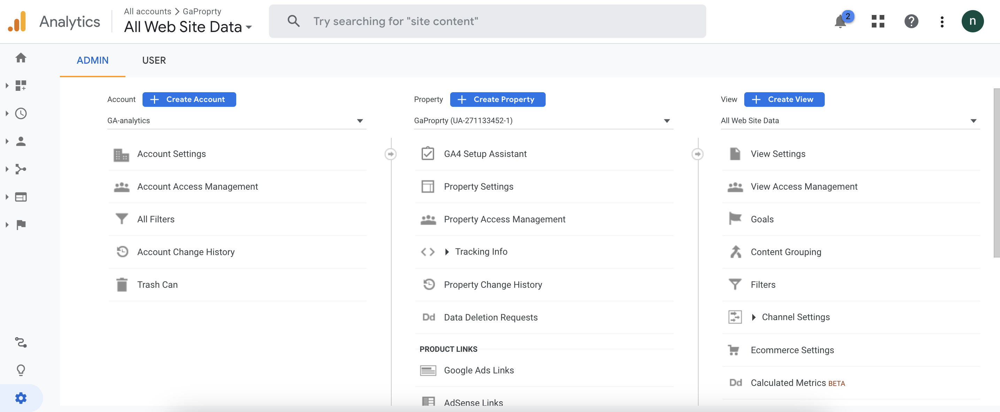
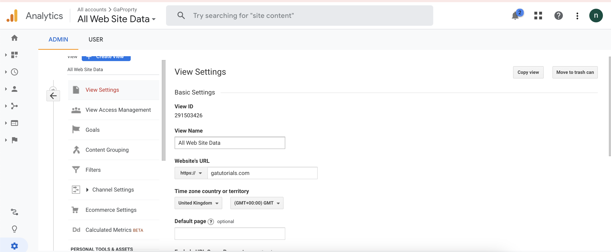
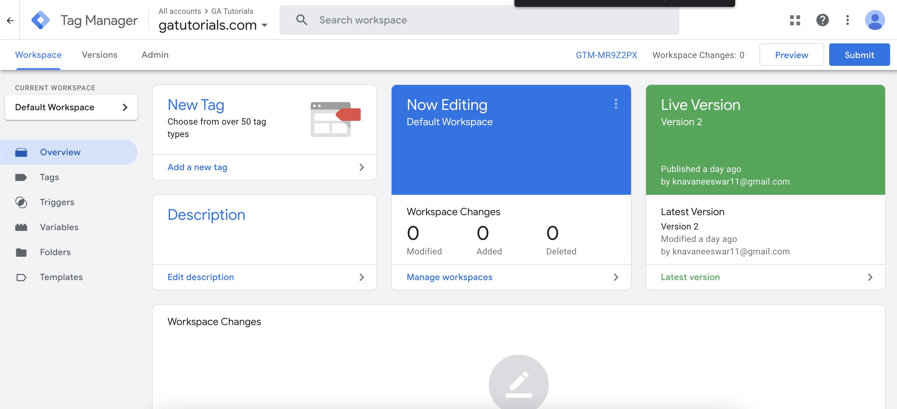
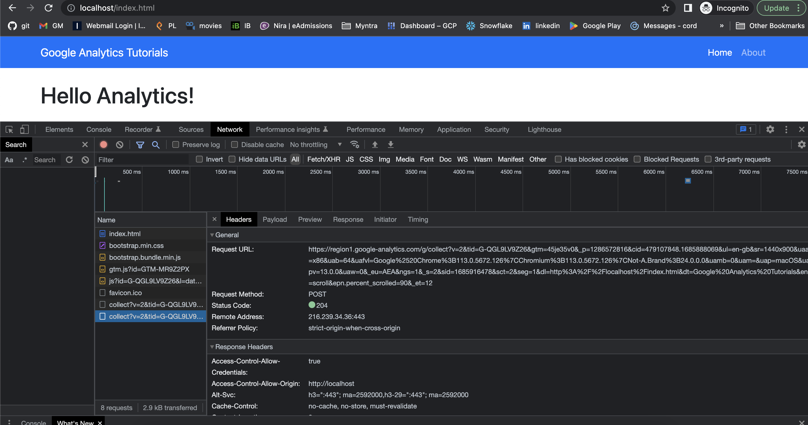

Node POC : Getting top page views from Google analytics API

prerequiste :

Set up a new project in the Google Cloud Console:

- Go to the Google Cloud Console (https://console.cloud.google.com).
- Create a new project or select an existing project.
- Enable the Google Analytics API for your project.
- Create credentials (OAuth 2.0 client ID) for your project, and note down the client ID and client secret.

Set up your Node.js project:

- Create a new directory for your project.
- Initialize a new Node.js project with npm init and follow the prompts.
- Install necessary dependencies by running npm install express googleapis.
- Set up the Express server and Google Analytics API client:

Create an app.js file in your project directory.
Import the required modules:
const express = require('express');
const { google } = require('googleapis');

Steps to Run the project:
npm start

Create a project in GCP console and create service account and save credentials as json file

Subscribe GA API

adding service account in google analtics 

Real time google analytics overview

Created account proprty and view

View id and settings

creating Tag and publishing tag

Pusging data to google analytics

